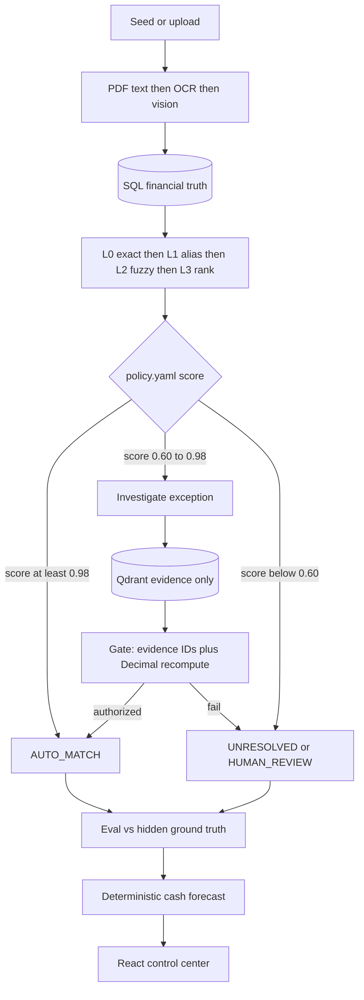

# AI Finance Controller

**Run the books and the cash position.**

**Postgres/SQLite = truth. Qdrant = evidence. LLM = proposal. Decision gate = authority.**

Full receipts (IDs, math, 200-record partition): [docs/TRACK_PROOF.md](docs/TRACK_PROOF.md).

---

## Result that actually ran (200 records, seed 42)

Live `POST /api/demo/run` — not a slide.

| | |
|---|---|
| F1 | **78.5%** |
| L0 exact `AUTO_MATCH` | **131** |
| L1 vendor-alias `AUTO_MATCH` | **20** |
| Agent `AUTO_RESOLVE` (contract variance) | **3** |
| `UNRESOLVED` (honest exceptions) | **46** |
| L2 / L3 auto-posted | **0 / 0** |
| LLM calls | **0** |
| **Sum** | **131 + 20 + 3 + 46 = 200** |

`131 + 46 = 177` is not a hole. The other **23** are **20 alias matches + 3 gated auto-resolves**.

We do not claim 100%. Matcher confidence ≠ authorized match.

### Worked A — authorized: TX_0022

Tata Communications settlement **₹697,217.48** vs invoice **INV_0022 ₹688,950.08**. Python variance **1.20%** vs vendor cap **2.00%**. Evidence: `INV_0022`, `TX_0022`, `VENDOR_TATA`, `SETTLEMENT_POLICY_02`. Gate recomputed Decimal math. Verdict **AUTO_RESOLVE** / `CONTRACTUAL_VARIANCE` / `authorized: true`. LLM not used. Also **TX_0082** (Microsoft, 1.20% vs 1.50% cap).

### Worked B — refused: TX_0002 / EX_72DB2E48ED

₹638,759.77 · `AMBIGUOUS_MATCH` · candidates **INV_0002, INV_0010, INV_0018**. Reason: insufficient unique evidence. Verdict **UNRESOLVED**. The controller did not pick a winner.

### Worked C — hallucination rejected

Audit **`GATE_REJECTED_HALLUCINATION`**: proposed `AUTO_RESOLVE` with invented `CONTRACT_HALLUCINATED_99` and difference 1000 on a 8000 gap. Gate: unknown evidence ID + Decimal mismatch → **HUMAN_REVIEW**, `authorized: false`.

---

## Architecture



Duplicates skip LLM (structural key: amount + currency + reference).

**L3 LightGBM:** trained on seed-42 synthetic pair features (vendor/amount/date/ref/currency); labels from the generator. Hidden GT is eval-only. We do not claim live-bank generalization. L3 cannot post the ledger — this demo: **0** L3 auto-matches.

If LLM or OCR is down, L0/L1 still close books (this run: 0 LLM calls).

---

## Quick start

```bash
cp .env.example .env
docker compose up --build
```

- UI landing (Vertex): http://localhost:5173  
- Control center: http://localhost:5173/app  
- Settlement agent: http://localhost:5173/app/settlement  
- API: http://localhost:8000/api/docs  
- Auth: `Authorization: Bearer demo-token`

```bash
python scripts/prove_track.py 80
cd backend && pytest -q
```

## 5-minute demo

1. RUN DEMO → wait for the button to idle  
2. Dashboard: 200-way split above  
3. Graph **TX_0022** (authorized variance)  
4. Exception **TX_0002** (refused)  
5. Audit `GATE_REJECTED_HALLUCINATION`  
6. Cash 7/30-day + what-if  

.
