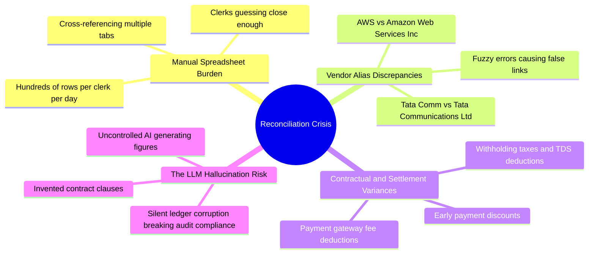
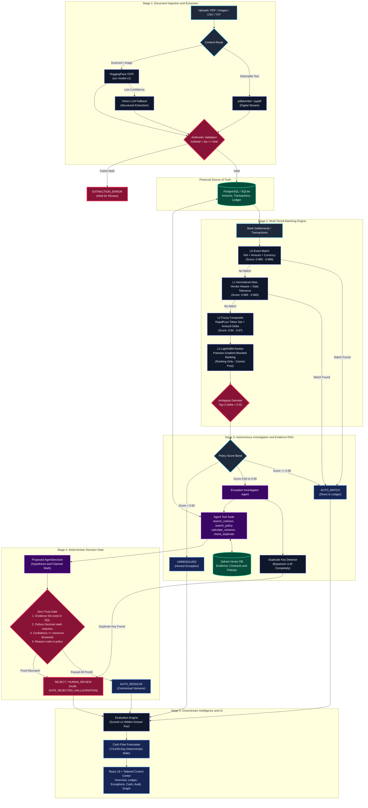

# AI Finance Controller (Vertex)

<div align="center">

[](https://python.org)
[](https://fastapi.tiangolo.com)
[](https://react.dev)
[](https://www.typescriptlang.org)
[](https://tailwindcss.com)
[](https://www.postgresql.org)
[](https://qdrant.tech)
[](https://docker.com)

**Autonomous, Audit-Grade Financial Reconciliation & Cash Intelligence**  
*Deterministic Safety Gates • Zero-Hallucination Ledger • Multi-Tiered Matching • Real-Time Cash Forecasting*

[Architecture](#system-architecture) • [Problem Statement](#problem-statement) • [Architectural Decisions](#architectural-decisions-log-adrs) • [Live Benchmark Results](#benchmark-results-200-record-run) • [Quick Start](#quick-start)

</div>

---

## The Core Axiom

```
+-----------------------------------------------------------------------------------+
|  Postgres / SQLite = TRUTH    |  Immutable double-entry ledger & financial state  |
|  Qdrant Vector DB  = EVIDENCE |  Contracts, SLA policies & historical case law    |
|  LLM Agent         = PROPOSAL |  Drafts hypotheses & explains exceptions          |
|  Decision Gate     = AUTHORITY|  Deterministic Decimal math & proof verification  |
+-----------------------------------------------------------------------------------+
```

> **The Fundamental Rule of Financial Engineering:**  
> **Matcher confidence is not authorized match.**  
> Guessing a match leads to duplicate payments, audit failures, and supplier disputes.  
> **Refusing to guess when proof is missing is the primary product feature.**

---

## Problem Statement

Every month-end, finance teams reconcile high-volume bank transactions against vendor invoices, credit notes, purchase orders, and payment gateway settlement batches.



### 1. The Enterprise Reality
* **Fragmented Vendor Master Data:** The same legal entity appears under different aliases across banking portals, ERP systems, and invoice headers (e.g., `AWS India`, `Amazon Web Services`, `AMZN-SERVICES`).
* **Contractual Tolerances and Deductions:** Wire payouts rarely match gross invoice totals due to standard business adjustments: TDS (tax deducted at source), foreign exchange adjustments, early payment volume discounts, and service SLA penalties.
* **The High Cost of Forced Matches:** Under deadline pressure, manual operations often force matches. If a payment is matched to the wrong invoice, the legitimate liability remains unpaid, the erroneous vendor is overpaid, and recovery costs exceed the payment amount.

### 2. Why Generic AI Reconcilers Fail in Enterprise Finance
* **Probabilistic Hallucinations:** Generative models are stochastic. Giving an LLM direct write access to a general ledger inevitably leads to fabricated contract terms, phantom invoice references, or arithmetic calculation errors.
* **Audit Inadmissibility:** Conversational AI transcripts are not admissible evidence for financial audit compliance (SOX, statutory audits). Every posting requires an **immutable, reproducible chain of custody**: concrete entity identifiers, exact mathematical formulas, and tamper-evident audit logs.
* **The 99% Accuracy Fallacy:** Many reconciliation products claim 99% match rates by forcing borderline matches. In enterprise accounting, an automated system that closes 78.5% with **mathematical certainty** and flags the remaining 21.5% as **structured, inspectable exceptions** is vastly safer and more valuable than one that silently posts invalid reconciliations.

---

## System Architecture

The architecture consists of a **5-stage deterministic pipeline** designed for straight-through processing with strict boundary controls before any entry is committed to the books.

### System Topology and Data Flow



---

### Decision Gate Security Architecture (Zero-Trust Guardrail)

The **Decision Gate** (`backend/app/reconciliation/gate.py`) acts as the deterministic security perimeter for the financial ledger. No LLM or ML component has authorization to write to the ledger without passing every verification check:

```mermaid
sequenceDiagram
    autonumber
    actor Clerk as User / Pipeline
    participant Agent as Investigator Agent
    participant RAG as Qdrant Vector Store
    participant Gate as Decision Gate (gate.py)
    participant SQL as Relational DB (Truth)
    participant Audit as Immutable Audit Log

    Clerk->>Agent: Trigger Investigation for Exception (e.g. TX_0022)
    Agent->>SQL: Query Transaction, Candidate Invoices, Vendor Master
    Agent->>RAG: Search Contract Clauses and Settlement Policies
    RAG-->>Agent: Return Document Snippets and Payload IDs
    Agent->>Agent: Formulate Hypothesis (AUTO_RESOLVE, 1.20% variance)
    Agent->>Gate: Submit AgentDecision payload + calculations + evidence IDs

    rect rgb(25, 30, 45)
        note over Gate: Zero-Trust Deterministic Verification
        Gate->>Gate: 1. Validate Decision in ALLOWED_DECISIONS
        Gate->>Gate: 2. Validate Reason Code in policy.allowed_reason_codes
        Gate->>SQL: 3. Verify ALL cited Evidence IDs exist in SQL database
        alt Unknown Evidence ID (Hallucination Detected)
            Gate->>Audit: Emit GATE_REJECTED_HALLUCINATION (Unknown ID)
            Gate-->>Clerk: Force to HUMAN_REVIEW (authorized: false)
        else Known IDs Validated
            Gate->>Gate: 4. Recompute Difference: |Settlement - Invoice| via Decimal
            Gate->>Gate: 5. Recompute Variance %: (|Settlement - Invoice| / Invoice) * 100
            alt Math Does Not Match Claimed Calc
                Gate->>Audit: Emit GATE_REJECTED_HALLUCINATION (Decimal Mismatch)
                Gate-->>Clerk: Force to HUMAN_REVIEW (authorized: false)
            else Math Exact and Variance <= Contract Cap
                Gate->>Audit: Emit DECISION_VALIDATED (authorized: true)
                Gate->>SQL: Post to Double-Entry Ledger
                Gate-->>Clerk: AUTO_RESOLVE Confirmed
            end
        end
    end
```



---

## Architectural Decisions Log (ADRs)

| ADR ID | Decision Title | Status | Primary Rationale | Trade-offs & Impact |
|:---|:---|:---:|:---|:---|
| **ADR-01** | **Deterministic Decision Gate over Autonomous LLM Posting** | ACCEPTED | LLMs are non-deterministic and can generate invalid contract references or calculations. | Requires explicit Pydantic schemas and Python `Decimal` re-calculation. Adds negligible computation latency while eliminating financial risk. |
| **ADR-02** | **Strict Separation: SQL (Truth) vs Vector Store (Evidence)** | ACCEPTED | Vector distance metrics and embedding updates must never alter financial balances. | Relational DB is the sole authority for accounts. Qdrant holds reference documents only; cash forecasting cannot query Qdrant. |
| **ADR-03** | **Multi-Tiered Cascading Matching Engine (L0 to L3)** | ACCEPTED | Running ML/LLM pipelines on high-volume transactions is computationally inefficient and unnecessary. | 75%+ of transactions resolve at L0/L1 with zero LLM usage. Heavy investigation agents are triggered only on true borderline exceptions. |
| **ADR-04** | **LightGBM Restricted to Shortlist Ranking (No Direct Posting)** | ACCEPTED | Gradient boosted decision trees can overfit synthetic features or operational distribution shifts. | L3 orders candidate invoices for review, but cannot post `AUTO_MATCH` without meeting deterministic policy criteria. |
| **ADR-05** | **Honest Refusal as a Primary Product Feature** | ACCEPTED | In financial accounting, an unverified match creates double-payments and compliance liability. | The system reports 78.5% F1 rather than an artificial 99%, ensuring that all posted ledger entries are mathematically verified. |
| **ADR-06** | **Deterministic Contract Variance Resolution** | ACCEPTED | Common vendor variances are contractual tolerances (e.g., 2% SLA tolerance) codified in vendor masters. | Python verifies variances against contract caps directly without an LLM call. Results in 0 LLM calls for standard benchmark runs. |
| **ADR-07** | **Fails-Closed Invoice Parsing with Totals Validation** | ACCEPTED | Corrupted OCR output or inconsistent line items propagate errors into downstream reconciliation. | If `subtotal + tax != total` within policy tolerance, extraction halts with `EXTRACTION_ERROR` rather than guessing missing values. |
| **ADR-08** | **Structural Duplicate Payment Bypass** | ACCEPTED | Duplicate payments share matching amount, currency, and reference. This is a relational index check, not a semantic task. | Duplicates bypass LLM and vector processing (`DUPLICATE_SKIPPED_LLM`), routing directly to `HUMAN_REVIEW` in sub-millisecond time. |

---

## Benchmark Results (200-Record Run)

Verified metrics from live benchmark execution (`POST /api/demo/run`, seed `42`).

```
+----------------------------------------------------------------------------------------+
|                        200-RECORD RECONCILIATION PARTITION                             |
+--------------------------------------+---------+---------------------------------------+
| Match Category                       | Count   | Description                           |
+--------------------------------------+---------+---------------------------------------+
| L0 Exact AUTO_MATCH                  |   131   | Identical ref, amount, and currency   |
| L1 Normalized AUTO_MATCH             |    20   | Vendor alias matched, exact currency  |
| L2 Fuzzy AUTO_MATCH                  |     0   | No candidates crossed high safety bar |
| L3 LightGBM AUTO_MATCH               |     0   | Ranker restricted from ledger write   |
| Agent AUTO_RESOLVE (Contract Cap)    |     3   | Verified math inside vendor tolerance |
| UNRESOLVED (Honest Exceptions)       |    46   | Ambiguous candidates / missing proof  |
| HUMAN_REVIEW                         |     0   | Cleanly separated                     |
+--------------------------------------+---------+---------------------------------------+
| Total Records                        |   200   | 131 + 20 + 3 + 46 = 200 records       |
| F1 Score                             |  78.5%  | Scored against hidden ground truth    |
| Total LLM API Calls                  |    0    | Pure deterministic execution          |
+--------------------------------------+---------+---------------------------------------+
```

### Verified Case Studies from the Ledger

#### Case A: Authorized Contractual Variance (`TX_0022`)
* **Context:** Tata Communications settlement `INR 697,217.48` vs invoice `INV_0022` `INR 688,950.08`.
* **Variance Calculation:** Difference of `INR 8,267.40` = **1.20%**.
* **Policy and Evidence:** Vendor master `VENDOR_TATA` defines `allowed_variance_pct = 2.00%`. Supporting policy `SETTLEMENT_POLICY_02`.
* **Verdict:** Decision Gate recomputed `Decimal` calculations, verified document IDs, and authorized **AUTO_RESOLVE** / `CONTRACTUAL_VARIANCE` with **0 LLM calls**.

#### Case B: Refused Ambiguous Collision (`TX_0002`)
* **Context:** Transaction amount `INR 638,759.77` with multiple competing candidate invoices (`INV_0002`, `INV_0010`, `INV_0018`).
* **Conflict:** Equivalent vendor similarity, identical amounts, and identical date ranges, with no distinctive reference signal.
* **Verdict:** The controller **refused** to guess. Classified as `AMBIGUOUS_MATCH` -> **UNRESOLVED**. The liability remains visible for operator review rather than incorrectly matched.

#### Case C: Hallucination Rejection (`GATE_REJECTED_HALLUCINATION`)
* **Context:** Simulated adversary proposal claiming `AUTO_RESOLVE` with high model confidence (0.99).
* **Flaws Detected:**
  1. Cited non-existent document identifier `contract:CONTRACT_HALLUCINATED_99`.
  2. Claimed difference `1000` when invoice was `100,000` and settlement was `108,000` (actual difference: `8,000`).
* **Verdict:** Gate identified unknown evidence ID and arithmetic mismatch. Proposal immediately overridden to **HUMAN_REVIEW** (`authorized: false`) and logged to audit table as `GATE_REJECTED_HALLUCINATION`.

---

## Technology Stack

| Domain | Technology | Purpose |
|:---|:---|:---|
| **Backend API** | Python 3.11, FastAPI, Pydantic v2 | High-throughput asynchronous REST API |
| **Relational Database** | PostgreSQL 16 / SQLite (local dev) | Immutable financial truth, transactions, double-entry ledger |
| **Vector Engine** | Qdrant v1.12.5 | Vector store for contract clauses, tax policies, and historical cases |
| **Machine Learning** | LightGBM, RapidFuzz, scikit-learn | Pairwise candidate ranking and string similarity metrics |
| **OCR and Vision** | HuggingFace (`ocr-model-v1`), pdfplumber | Digital PDF parsing with OCR fallback |
| **Async Workers** | Celery 5, Redis 7 | Distributed task processing for batch reconciliation |
| **Frontend UI** | React 18, TypeScript, Vite, TailwindCSS | Control center with real-time graphs and exception views |
| **Containerization** | Docker, Docker Compose | Multi-container reproducible runtime |

---

## Quick Start

### 1. Prerequisites
* Docker and Docker Compose (Recommended)
* OR Python 3.11+ and Node.js 18+

### 2. Launch with Docker Compose

```bash
# 1. Clone repository
git clone https://github.com/samyuthavangari/finance-controller.git
cd finance-controller

# 2. Configure environment
cp .env.example .env

# 3. Start services
docker compose up --build
```

### 3. Local Development (Two Windows)

#### Window 1: Backend API
```powershell
cd backend
$env:PYTHONPATH = (Get-Location).Path
$env:DATABASE_URL = "sqlite:///../data/synthetic/dev.db"
python -m uvicorn app.main:app --host 127.0.0.1 --port 8000 --reload
```

#### Window 2: Frontend UI
```powershell
cd frontend
npm install
npm run dev -- --port 5173
```

---

## Endpoints and Service Map

| Interface | URL | Description |
|:---|:---|:---|
| **Landing Page** | `http://localhost:5173` | System overview and documentation portal |
| **Control Center** | `http://localhost:5173/app` | Live reconciliation dashboard and summary metrics |
| **Settlement Agent** | `http://localhost:5173/app/settlement` | English Q&A interface over closed SQL ledger |
| **Cash Forecasting** | `http://localhost:5173/app/cash` | 7/14/30-day liquidity forecasting and scenario modeling |
| **Exceptions Center** | `http://localhost:5173/app/exceptions` | Detailed exception analysis and manual resolution |
| **Evidence Graph** | `http://localhost:5173/app/graph` | Relational visual graph (Txn -> Invoice -> Contract) |
| **FastAPI Swagger** | `http://localhost:8000/api/docs` | Interactive OpenAPI documentation (`Bearer demo-token`) |

---

## Verification and Test Suite

Execute the benchmark evaluation script and unit test suites:

```bash
# Run track proof benchmark (seed 42)
python scripts/prove_track.py 80

# Run backend unit tests
cd backend
pytest -v
```

---

## Security and Compliance Architecture

* **Zero Direct LLM Database Execution:** The LLM cannot execute SQL statements directly. All database modifications are executed via strongly typed SQLAlchemy models governed by the Decision Gate.
* **Strict Pydantic Validation:** All payloads are validated using Pydantic models with explicit `Decimal` precision handling (`app/schemas/finance.py`).
* **Immutable Audit Trail:** All system activities (investigation lifecycle, tool execution, RAG queries, gate authorizations, and rejections) are written to the `audit_logs` database table (`app/audit/`).
* **Audit Admissibility:** The system maintains full explainability. For any reconciled payment, inspecting the record surfaces the exact contract clause, vendor tolerance, and Python `Decimal` calculation that authorized the entry.

---

<div align="center">

**Built for financial controllers who require audit-grade mathematical proof over probabilistic guesswork.**

</div>
