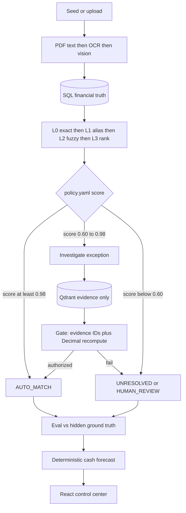

# Track proof — what actually fired

Source of the **200-record** counts: live `POST /api/demo/run` on 2026-08-27 (uvicorn log: 200 OK).  
Worked-example IDs below were re-read from the same SQLite controller DB (`data/synthetic/dev.db`) after that session. **Not typed from memory.**

Reproduce: `python scripts/prove_track.py 80` or UI **RUN DEMO**. Seed **42**. Hidden ground truth is never passed to Gemini.

---

## Headline

| Metric | Value |
|---|---|
| Records | **200** (track minimum 50) |
| F1 | **78.5%** |
| Match accuracy | **~71–72%** (eval engine vs hidden labels) |
| Throughput | **~9 rec/s** on the 80-record freeze; 200-record demo wall ~43s |
| LLM calls | **0** |

We do not claim 98%. High matcher confidence is not authorization.

---

## Where every one of the 200 records went

A judge subtracting `131 + 46 = 177` is correct — **23 records are not in those two buckets**. They are not missing. They are not “stuck in investigate.” Full partition:

| Bucket | Count | What it is |
|---|---|---|
| L0 exact `AUTO_MATCH` | **131** | Same invoice ref + amount + currency |
| L1 normalized `AUTO_MATCH` | **20** | Vendor alias (e.g. AWS ↔ Amazon Web Services), still exact money |
| L2 fuzzy auto | **0** | None crossed `policy.yaml` auto threshold |
| L3 LightGBM auto | **0** | Ranked only; none posted to the ledger |
| Agent `AUTO_RESOLVE` | **3** | Amount mismatch inside vendor/contract cap; gate authorized |
| `HUMAN_REVIEW` | **0** | None in this run |
| `UNRESOLVED` | **46** | Insufficient unique evidence — honest exception list |
| **Total** | **200** | 131 + 20 + 3 + 46 = **200** |

Exceptions opened: **49** = 46 unresolved + 3 auto-resolved. Nothing left in limbo.

---

## Worked case A — gate **authorized** a variance

**TX_0022** · Tata Communications · `AMOUNT_MISMATCH`

| | |
|---|---|
| Settlement | ₹697,217.48 |
| Invoice | **INV_0022** ₹688,950.08 |
| Python calc | difference **₹8,267.40** · variance **1.20%** |
| Cap | vendor `VENDOR_TATA` `allowed_variance_pct=2.00` + policy `SETTLEMENT_POLICY_02` |
| Matcher | Not L0 (amount not exact) → investigation |
| Tools | `search_invoice`, `search_vendor`, `calculate_variance` — **no Gemini** |
| Gate | Evidence IDs exist; Decimal recompute of 1.20% matches claimed calc |
| Verdict | **AUTO_RESOLVE** · `CONTRACTUAL_VARIANCE` · `authorized: true` |

Second authorized row in DB: **TX_0082** Microsoft, ₹335,777.49 vs **INV_0082** ₹331,795.94, variance **1.20%**, Microsoft cap **1.50%** → same verdict.

---

## Worked case B — controller **refused** to pick a winner

**EX_72DB2E48ED** · **TX_0002** · ₹638,759.77 · `AMBIGUOUS_MATCH`

- Candidates: **INV_0002**, **INV_0010**, **INV_0018** (similar vendor / amount / date)
- Recorded reason: *Possible invoices: INV-0002 INV-0010. Similar vendor/amount/date. Evidence: Insufficient.*
- Verdict: **UNRESOLVED** — no forced match

Same pattern: **TX_0003** (INV-0003 vs INV-0011), **TX_0007** (INV-0007 vs INV-0015).

---

## Worked case C — hallucinated LLM proposal **rejected**

Audit event **`GATE_REJECTED_HALLUCINATION`** on the same run.

A payload equivalent to Gemini inventing a close:

- Proposed: `AUTO_RESOLVE` confidence 0.99  
- Invented evidence: `contract:CONTRACT_HALLUCINATED_99`  
- Invented math: invoice 100000, settlement 108000, claimed difference 1000 (false)

Gate notes: `unknown evidence contract:CONTRACT_HALLUCINATED_99; difference does not match invoice vs settlement`

Outcome: **HUMAN_REVIEW**, `authorized: false`. The model may propose. It may not close the books.

---

## Architecture (rendered flow)



SQL = truth. Qdrant = contracts/policies/history. Gemini = proposal only. Gate = authority.

Duplicates skip Gemini: same amount + currency + payment reference is a **key**, not a contract question (`DUPLICATE_SKIPPED_LLM`).

---

## LightGBM L3 — trained on what, generalizes how

- **Trained on:** synthetic pair features from `scripts/generate_dataset.py` (seed 42): vendor similarity, amount difference and %, date distance, invoice-ref similarity, currency match, bank-ref similarity, historical vendor match rate. Labels come from the **generator**, not from production banks.
- **Not trained on:** hidden `ground_truth` rows at **inference** time — those are eval-only.
- **Generalization:** we **do not** claim this booster transfers to live traffic. It can overfit generator quirks. That is why L3 **cannot write the ledger**; `policy.yaml` plus the gate still decide. On the 200-record demo, L3 auto-matches = **0**. If `match_model.txt` is missing, a linear heuristic with the same features is used.

---

## Reproduce

```bash
python scripts/prove_track.py 80
# or UI RUN DEMO against the API
```
